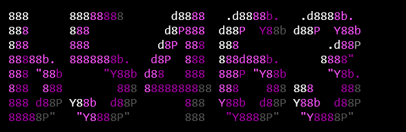

  

  Alexander Jakub Moravčík 
  camera hardware / device software / self-hosted deployment

  <a href="https://github.com/b5463/kino-d4">[ KINO D4 ]</a>
  &nbsp;&nbsp;
  <a href="https://github.com/b5463/systems">[ SYSTEMS. ]</a>
  &nbsp;&nbsp;
  <a href="https://github.com/sponsors/b5463">[ FUNDING ]</a>

I work on camera hardware, device protocols, control software, and self-hosted deployment.

## 00 / active

<pre>
+----+------------+-------------------+----------------------------------+
| ID | PROJECT    | STATE             | SCOPE                            |
+----+------------+-------------------+----------------------------------+
| 01 | KINO D4    | D4-V1 prototype   | four-lens camera + USB studio    |
| 02 | SYSTEMS.   | 2.0.0-rc.1        | deployment + host operations     |
+----+------------+-------------------+----------------------------------+
</pre>

## 01 / [KINO D4](https://github.com/b5463/kino-d4)

KINO D4 is a handmade four-lens camera. One shutter press captures four viewpoints; the originals stay on the card, and software can turn them into a short parallax loop.

<pre>
[CAM 01]--+
[CAM 02]--+
[CAM 03]--+-->[shared sync]-->[ESP32-P4]-->[microSD originals]
[CAM 04]--+                         |
                                    +-->[USB / KDP]-->[KINO Studio]

hardware      D4-V1 / prototype
studio        0.9.0
protocol      KDP 1
storage       microSD originals first
license       CERN-OHL-S-2.0 hardware / MIT software
</pre>

repository map

<pre>
hardware/                 build files, manifest, revisions, and ECNs
apps/studio/              USB control and capture interface
apps/api/                 API foundation
packages/kdp/             KINO Device Protocol
packages/schemas/         shared data contracts
packages/test-fixtures/   simulator fixtures
docs/                     build, bring-up, recovery, and release notes
</pre>

[`OPEN KINO D4 ->`](https://github.com/b5463/kino-d4)

## 02 / [SYSTEMS.](https://github.com/b5463/systems)

SYSTEMS. builds a zip into a Docker deployment, routes it through Caddy, and keeps logs, health checks, rollback, and backups in the admin panel.

<pre>
[ZIP]-->[BUILD]-->[DOCKER]-->[CADDY]-->[HTTPS]
                    |
                    +-->[LOGS]
                    +-->[HEALTH]
                    +-->[ROLLBACK]
                    +-->[BACKUPS]

release       2.0.0-rc.1
access        authenticated admins / two maximum
production    Windows host
validation    real Windows host pending
license       PolyForm Noncommercial 1.0.0
</pre>

repository map

<pre>
dashboard      Vue
api            Fastify / Node.js
data           PostgreSQL / Redis / S3
runtime        Docker / Caddy
operations     logs, health, rollback, and backup
</pre>

[`OPEN SYSTEMS. ->`](https://github.com/b5463/systems)

## 03 / workbench

<pre>
camera       ESP32-P4 / ESP32-S3 / microSD
protocol     KDP / Web Serial / JSON schemas
interface    TypeScript / React / Vue / Vite
services     Node.js / Fastify / PostgreSQL / Redis
host         Docker / Caddy / HTTPS / GitHub Actions
</pre>

## 04 / links

<pre>
repos       <a href="https://github.com/b5463?tab=repositories">github.com/b5463?tab=repositories</a>
kino-d4     <a href="https://github.com/b5463/kino-d4">github.com/b5463/kino-d4</a>
systems     <a href="https://github.com/b5463/systems">github.com/b5463/systems</a>
funding     <a href="https://github.com/sponsors/b5463">github.com/sponsors/b5463</a>
</pre>
