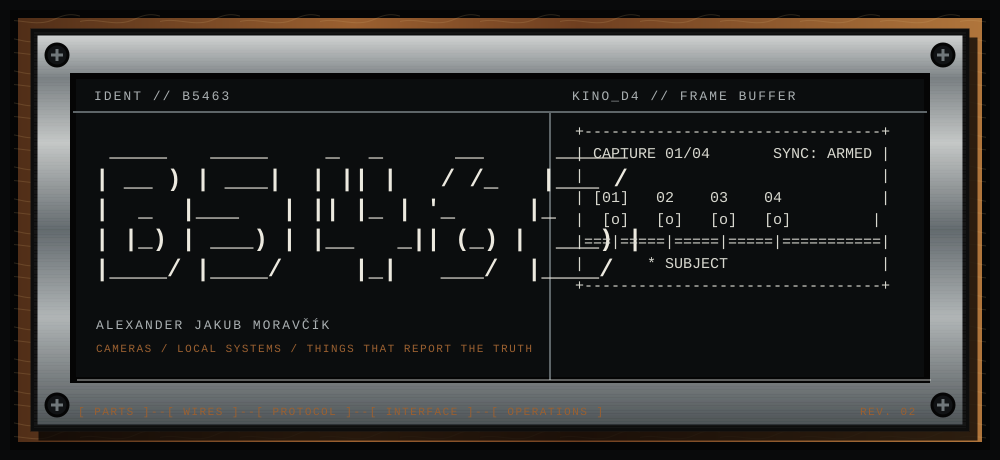

  

  <a href="https://github.com/b5463/kino-d4"><b>[ KINO D4 ]</b></a>
  &nbsp;&nbsp;
  <a href="https://github.com/b5463/systems"><b>[ SYSTEMS. ]</b></a>
  &nbsp;&nbsp;
  <a href="https://github.com/sponsors/b5463"><b>[ SPONSOR ]</b></a>

I'm Alex. I make cameras, self-hosted software, and the ugly control panels you need when five microcontrollers or a pile of containers stop agreeing with each other.

I like machinery you can open, software you can run yourself, and status lights backed by a real check.

<pre>
+-- CURRENT BENCH --------------------------------------------+
| KINO D4 / D4-V1 / PROTOTYPE                                |
| 4 VIEWPOINTS / 1 SHUTTER / ORIGINALS FIRST                 |
+-------------------------------------------------------------+
</pre>

## 01 / [KINO D4](https://github.com/b5463/kino-d4)

Four lenses fire from slightly different positions. The camera keeps all four originals, then turns them into a short loop with real parallax. No generated in-between frames and no cloud near the shutter.

The repository has the hardware build, KDP wire protocol, USB Studio, simulator, shared schemas, and the recovery paths for when something goes wrong.

<code>ESP32-P4</code> <code>4× ESP32-S3</code> <code>TypeScript</code> <code>React</code> <code>Web Serial</code>

**[OPEN THE CAMERA →](https://github.com/b5463/kino-d4)**

---

## 02 / [SYSTEMS.](https://github.com/b5463/systems)

Drop in a zip and get an HTTPS subdomain on your own machine. SYSTEMS. runs the build in Docker and keeps deployments, logs, observed health, rollback, and backups behind one admin login.

It is small on purpose. No public signup, no rented control plane, and no green light unless the machine answered a real check.

<code>Vue</code> <code>Fastify</code> <code>Docker</code> <code>Caddy</code> <code>SQLite</code> <code>PostgreSQL</code>

**[OPEN THE ENGINE →](https://github.com/b5463/systems)**

<pre>
+-- TOOL DRAWER ----------------------------------------------+
| TypeScript / React / Vue / Node.js / Fastify               |
| PostgreSQL / Docker / Caddy / ESP32 / Web Serial           |
+-------------------------------------------------------------+
</pre>

  If either repo saves you from a bad weekend, <a href="https://github.com/sponsors/b5463">help pay for the next spool of wire</a>.

